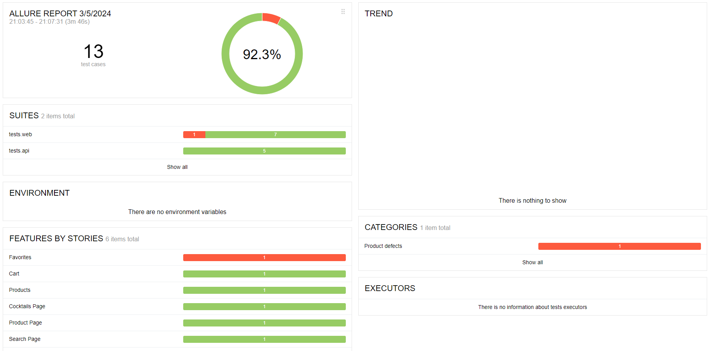
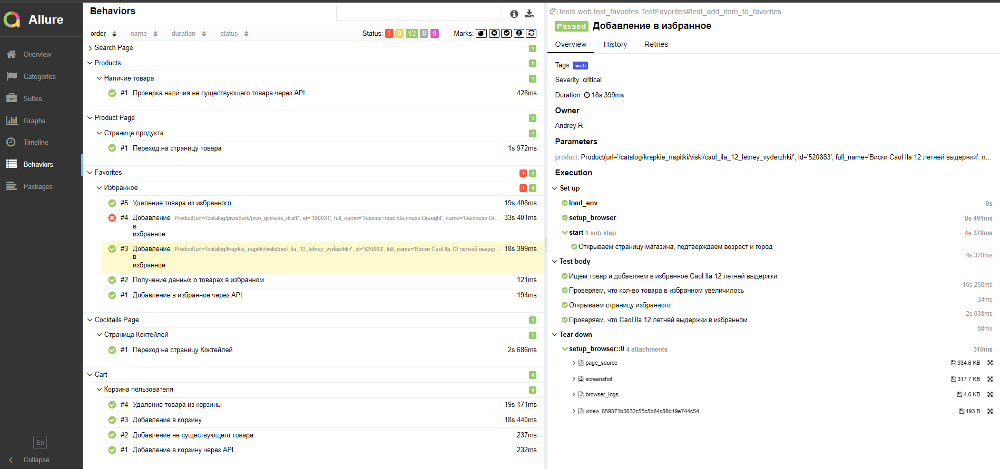
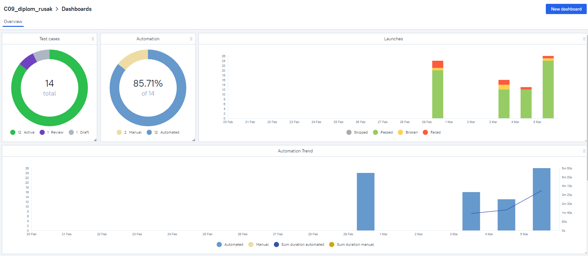
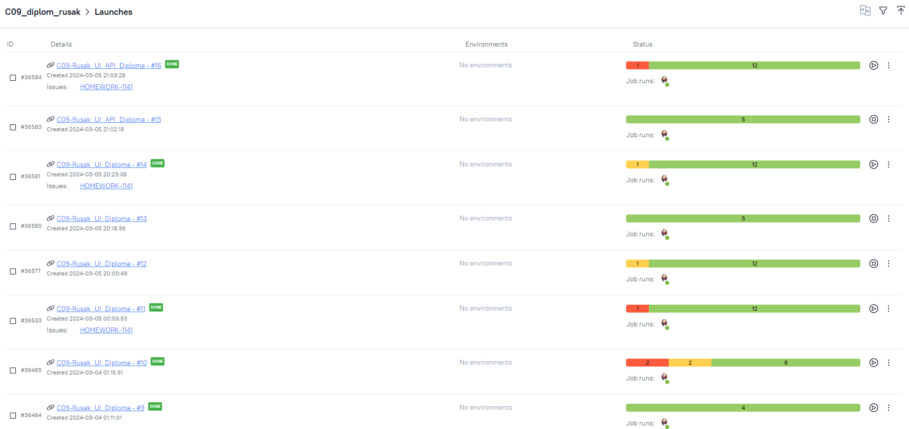
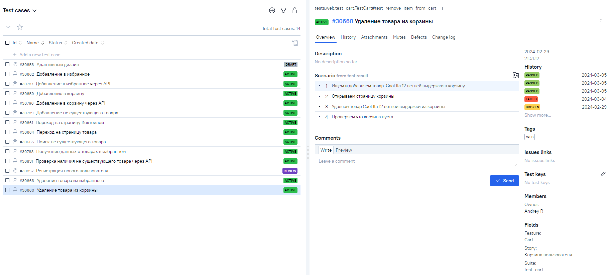
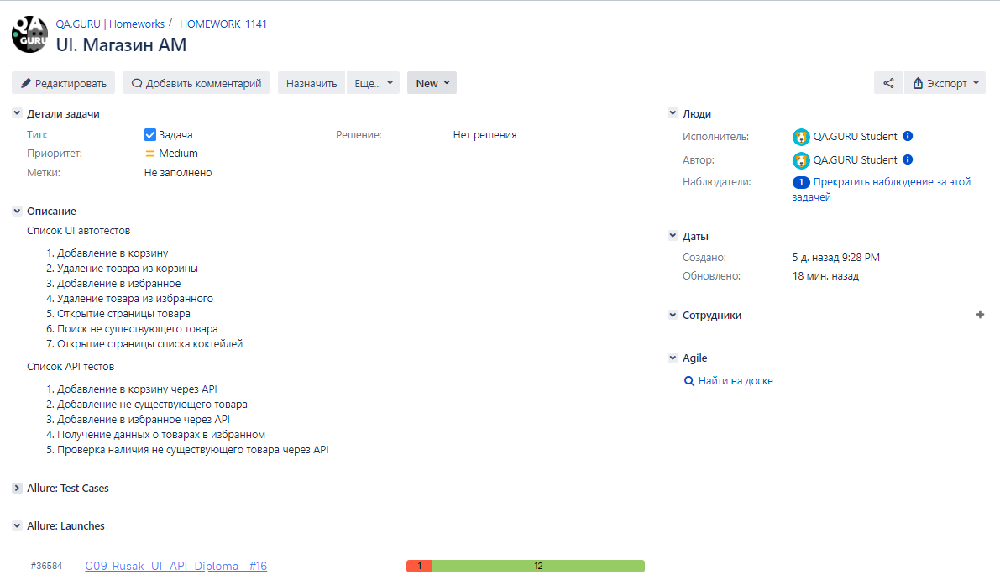
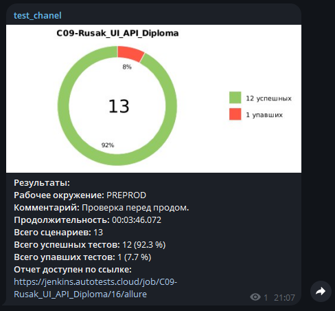
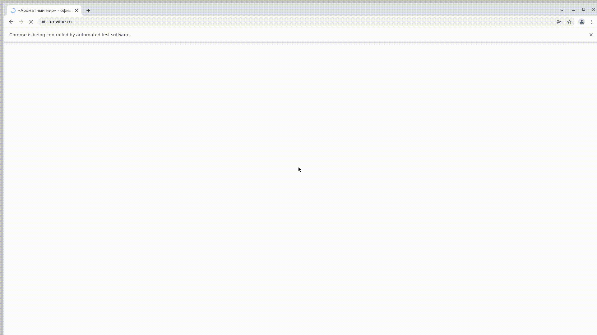

## Дипломный проект по автоматизации тестирования сайта Ароматный Мир

> <a target="_blank" href="https://amwine.ru">ссылка на сайт Ароматный Мир</a>

----

### Список UI автотестов

- [x] Добавление в корзину
- [x] Удаление товара из корзины
- [x] Добавление в избранное
- [x] Удаление товара из избранного
- [x] Открытие страницы товара
- [x] Поиск не существующего товара
- [x] Открытие страницы списка коктейлей

### Список API автотестов

- [x] Добавление в корзину через API
- [x] Добавление не существующего товара
- [x] Добавление в избранное через API
- [x] Получение данных о товарах в избранном
- [x] Проверка наличия не существующего товара через API

### Используемый стэк

        

----

### Локальный запуск автотестов

#### Выполнить в client:

> [!NOTE]
> Ключ выбора версии `--browser-version` не обязателен

```bash
python -m venv .venv
source .venv/bin/activate
pip install -r requirements.txt
pytest . --browser-version=100
```

#### Получение отчёта:

```bash
allure serve build/allure-results
```

### Проект в Jenkins

> <a target="_blank" href="https://jenkins.autotests.cloud/job/C09-Rusak_UI_Diploma/">Ссылка</a>

#### Параметры сборки

* environment - параметр определяет окружение для запуска тестов
* comment - комментарий

#### Запуск автотестов в Jenkins

1. Открыть <a target="_blank" href="https://jenkins.autotests.cloud/job/C09-Rusak_UI_API_Diploma/">проект</a>
2. Нажать "Build with Parameters"
3. Из списка "ENVIRONMENT" выбрать: PROD
4. В поле "COMMENT" ввести комментарий
5. Нажать "Build"

----

### Allure отчет

#### Общие результаты



#### Список тест кейсов


----

### Интеграция с Allure TestOps

#### Дашборд с общими показателями тестовых прогонов



#### История запуска тестовых наборов



#### Тест кейсы



----

#### Интеграция с JIRA



----

### Оповещения в Telegram


----

### Видео прохождения автотестов



----